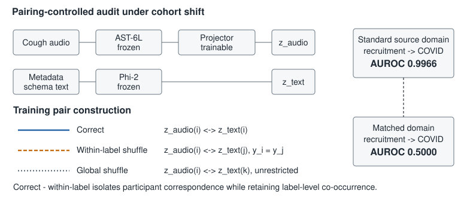
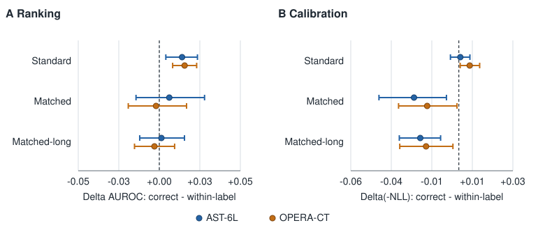

# Pairing-Controlled Auditing of Clinical Audio--Metadata Alignment:
# Separating Participant Correspondence from Transferable Disease Evidence

> **Draft status (2026-09-03).** The frozen UKCOVID Route-A audit and a preregistered
> secondary CODA TB sensitivity are complete. UKCOVID remains a discovery dataset because
> its official test sets informed earlier protocol development. CODA's original split-first
> gate failed; its visibly versioned match-first sensitivity passed and was executed without
> changing the frozen endpoint. Compact aggregate outputs and hashes are stored in `results/`.

## Abstract

Clinical audio models increasingly align recordings with patient metadata, implicitly
assuming that better correspondence yields better disease representations. Metadata,
however, mixes disease association with participant and cohort information. We introduce a
pairing-controlled audit that separates individual correspondence from label-level
co-occurrence using correct metadata, metadata shuffled within disease label, and globally
shuffled metadata. In UKCOVID, recruitment source predicts COVID with AUROC 0.9966 in
training but 0.5000 after covariate matching. With both AST-6L and OPERA-CT, correct pairing
improves unique-profile retrieval over within-label shuffling, confirming that alignment
learns participant correspondence. Correct pairing strongly retains sex information
(matched probe Delta AUROC +0.191 and +0.112), whereas its COVID increment is small and
uncertain (+0.006 and -0.002). Disease gains are not robust across backbones, linear and
nonlinear readouts, or raw-audio comparisons. Target-domain recalibration removes the
adverse negative-log-likelihood gap without creating a ranking gain, identifying unsupported
confidence rather than established ranking loss. In a secondary seven-country CODA TB
sensitivity, correct pairing again improved profile retrieval with both backbones and
retained age/sex information, while matched TB transfer was inconclusive and changed
direction across backbones. These results show why correspondence success and transferable
disease evidence require separate evaluation.

## 1. Introduction

Clinical audio models use symptoms, demographics, medical history, or text assembled from
these fields as auxiliary supervision. Contrastive alignment can make this context
accessible to an audio representation [@siam2026respiramfm]. Unlike an audible description
of pitch or timing, however, clinical metadata may describe the participant or recruitment
process rather than the waveform. The contrastive objective only observes which examples
are paired; it does not know which shared information is clinically portable.

This creates an evaluation ambiguity. High audio--metadata similarity may indicate (i)
participant correspondence, (ii) disease-label or population association, or (iii)
transferable acoustic disease evidence. Downstream accuracy on the same cohort does not
separate these abilities.

UKCOVID makes the ambiguity measurable. Its Standard distribution combines a largely
positive Test-and-Trace cohort and a largely negative population-surveillance cohort.
Recruitment source alone predicts COVID with AUROC 0.9966 in Standard train but 0.5000 in
the covariate-matched test population. Symptoms are also a source proxy: “no symptoms”
occurs in 0.786 of training negatives and 0.019 of positives [@coppock2024audio].

We propose a **Pairing-Controlled Transfer Audit**. In addition to correct and globally
shuffled pairs, a within-label shuffle pairs each recording with another same-label
participant's metadata. It preserves label-level co-occurrence while breaking individual
correspondence. We combine this manipulation with profile retrieval, information-channel
probes, matched-cohort disease evaluation, raw-audio fusion, probability transport, a fixed
nonlinear readout, and a second audio backbone.

Our contributions are:

1. a controlled protocol separating individual correspondence, label/population
   association, and disease transfer;
2. an audit sequence in which retrieval verifies that alignment worked, probes identify
   what was retained, and matched evaluation tests portability; and
3. a two-backbone case study showing measurable participant correspondence without a
   robust cross-backbone, cross-readout disease-transfer gain.

**Fig. 1.** Correct pairing contains label association and participant correspondence;
within-label shuffling retains the former and removes the latter; global shuffling removes
both. Matched evaluation tests whether the resulting representation transfers.

## 2. Method

### 2.1 Data and frozen representations

We use the participant-level UKCOVID Standard train split [@budd2024ukcovid]. After the
frozen audio-availability audit, it contains 20,714 participants; downstream evaluation uses
Standard test, a 1,814-participant covariate-matched test, and a participant-disjoint
4,196-participant matched-long sensitivity set. The matched sets balance the measured
covariates and recruitment-source label association, but cannot establish absence of all
confounding. Because these test sets informed earlier protocol development, all UKCOVID
results are discovery analyses.

We use two frozen audio representations: the first six layers of Audio Spectrogram
Transformer (AST-6L) [@gong2021ast] and OPERA-CT [@zhang2024opera]. Frozen Phi-2 encodes a
deterministic schema containing age, sex, smoking, asthma, other respiratory conditions,
and symptoms, with missingness explicit. COVID result, recruitment source, timestamps,
test details, and recording artefacts are excluded from the schema.

### 2.2 Pairing-controlled alignment

Following the Stage-1 form of RespiraMFM [@siam2026respiramfm], only an audio-side projector
is trained. It maps 768 to 1,024 to 2,560 dimensions using LayerNorm and ReLU after both
linear layers and dropout 0.1 after the first. For audio embedding (a_i), text embedding
(t_i), and projector (f_\theta), the one-directional loss is

\[
\mathcal{L}=-\frac{1}{N}\sum_i\log
\frac{\exp(\bar f_\theta(a_i)^\top\bar t_i/\tau)}
{\sum_j\exp(\bar f_\theta(a_i)^\top\bar t_j/\tau)},\qquad \tau=0.07,
\]

where bars denote L2 normalization inside the loss.

The trained arms are **correct**, **within-label shuffled**, and **globally shuffled**.
Within each of five seeds, arms share initialization, audio batch order, and dropout stream;
only pairing differs. Mappings are fixed per seed, forbid self-pairs, and train for 500
epochs with batch size 64 and Adam at (10^{-3}). Only the final checkpoint is evaluated.
No matched result selects an epoch, architecture, loss, or calibrator. Frozen raw audio is
the unaligned reference.

We denote correct minus within-label by (C-W), isolating participant correspondence;
within-label minus global by (W-G), isolating label/population association; and correct
minus raw by (C-R), measuring the change from unaligned audio.

### 2.3 Audit endpoints

**Correspondence manipulation check.** On complete Standard validation, each audio query
retrieves one of 1,871 unique schema profiles. The primary metric is macro-profile MRR:
reciprocal ranks are averaged within the true profile and then equally across profiles,
preventing common schemas from dominating. Confidence intervals jointly resample profiles
and alignment seeds.

**Information channels.** Identical regularized probes decode recording properties
(duration, file size, loudness, clipping), participant context (sex and age at least 65),
symptoms, recruitment source, and COVID. Decodability establishes information availability,
not causal classifier use.

**Disease transfer and fusion.** Linear readouts are selected and source-calibrated on
complete Standard validation. Matched results select nothing. We evaluate metadata (M),
raw audio (R), correct (C), within-label (W), global (G), and direct or raw-preserving
fusion. Paired AUROC and Delta(-NLL), where positive favours the first arm, jointly resample
participants and seeds.

**Alternative explanations.** A fixed MLP readout tests whether a linear head hides disease
information. Probability transport reports prior correction, a fixed confidence-shrinkage
curve, and participant-disjoint target calibration learned on matched-long and applied to
matched. The latter is a diagnostic assuming a target calibration cohort, not an unlabeled
deployment result.

## 3. Results

### 3.1 Alignment learned participant correspondence

Correct pairing improves macro-profile retrieval over both controls (Table 1). For AST,
(C-W) MRR is +0.003175 [0.001605, 0.004917]; for OPERA it is +0.003229
[0.001545, 0.005000]. All five seed effects are positive for both backbones. Thus the
subsequent transfer result cannot be attributed to a projector that learned nothing.

**Table 1. Unique-profile retrieval on Standard validation (macro-profile MRR).**

| Backbone | Correct | Within-label | Global | (C-W) [95% CI] |
|---|---:|---:|---:|---:|
| AST-6L | 0.008910 | 0.005735 | 0.004188 | +0.003175 [0.001605, 0.004917] |
| OPERA-CT | 0.008771 | 0.005542 | 0.004435 | +0.003229 [0.001545, 0.005000] |

### 3.2 The retained channel was participant context, not stable COVID information

On matched participants, correct pairing strongly improves sex decodability over the
within-label control: +0.1912 [0.1669, 0.2151] with AST and +0.1125
[0.0943, 0.1311] with OPERA. Age increases for AST (+0.0464 [0.0062, 0.0848]) but not
OPERA (-0.0004 [-0.0462, 0.0436]). OPERA also shows small acquisition-property effects.
COVID (C-W) is +0.0062 [-0.0150, 0.0273] for AST and -0.0020
[-0.0196, 0.0158] for OPERA.

Raw audio has higher absolute decodability than correct alignment for nearly every probe;
for example, sex (C-R) is -0.0590 for AST and -0.0317 for OPERA. We therefore interpret
the result as selective retention relative to the within-label projector, not demographic
information added beyond raw audio.

### 3.3 Correspondence did not yield a robust disease-transfer gain

Adding raw audio to metadata does not produce a detectable matched increment: Delta AUROC
is +0.0028 [-0.0016, 0.0073] for AST and +0.0041 [-0.0006, 0.0087] for OPERA. Correct
fusion versus within-label has a small AST ranking effect (+0.0156
[0.0034, 0.0276]) but not an OPERA effect (+0.0021 [-0.0068, 0.0107]); its Delta(-NLL)
is strongly adverse for both (-0.2698 and -0.1389). Correct fusion also does not outperform
metadata plus raw audio for either backbone.

A fixed MLP readout does not rescue the result. Audio-only (C-W) Delta AUROC is +0.0050
[-0.0154, 0.0270] for AST and -0.0052 [-0.0208, 0.0110] for OPERA. Correct versus raw is
-0.0113 [-0.0291, 0.0068] for AST and -0.0247 [-0.0404, -0.0081] for OPERA. The AST
fusion (C-W) effect persists (+0.0168 [0.0013, 0.0320]) but does not replicate with
OPERA (+0.0019 [-0.0087, 0.0117]) and remains much worse in NLL.

**Fig. 2.** Correspondence learning is reproducible, whereas matched disease ranking is
small, backbone-dependent, and unsupported by raw-audio comparisons.

### 3.4 The NLL penalty primarily reflects unsupported confidence

With source-domain calibration, audio-only (C-W) Delta(-NLL) on matched is -0.0249 for
AST and -0.0176 for OPERA, while Delta AUROC is +0.0062 and -0.0020. Prior-only correction
does not remove the NLL penalty. For AST, a prespecified shrinkage curve shows that the
negative NLL gap grows as predictions become sharper.

When a one-dimensional target calibrator is fitted on participant-disjoint matched-long and
transported to matched, the (C-W) NLL difference becomes +0.00013
[-0.00227, 0.00243] for AST and -0.00020 [-0.00261, 0.00228] for OPERA. AUROC remains
unchanged and uncertain. The source-calibrated penalty therefore mainly reflects confidence
scale mismatch; recalibration removes the penalty but does not create disease ranking.

### 3.5 Prespecified mechanism and external sensitivity

A 3-by-3 confounding/shortcut grid with ten seeds per cell learned correspondence, but
failed its preregistered high-confounding, dose-trend, and zero-confounding boundary gates.
A Phi-2 text sensitivity cell was also ineligible. We therefore do not use the synthetic
experiment as causal mechanism evidence.

For external validation, all 2,746 Coswara cough recordings were decoded and 2,646 passed
objective QC. At the frozen 100-pair matching floor, maximum covariate SMD was 0.140 versus
the preregistered 0.12 limit. The gate returned NO-GO before any representation, classifier,
or model score was produced. A second model-blind gate on CODA TB successfully decoded all
9,772 solicited-cough recordings and retained 1,081 eligible participants. Its final 100
matched TB-positive/TB-negative pairs had maximum absolute SMD 0.276 and maximum categorical
level difference 0.13, exceeding the frozen limits of 0.12 and 0.08. It also returned
NO-GO before any representation or model score.

After inspecting only that aggregate gate—and still before producing any CODA model
output—we visibly preregistered a secondary match-first sensitivity. All matching fields,
costs, thresholds and the deterministic trimming path were unchanged; the 100-pair target
was selected from all 1,081 eligible participants before the remaining participants were
split for development. The resulting target had maximum absolute SMD 0.0819 and maximum
categorical level difference 0.040, and passed every frozen v2 data gate in two identical
runs. We then froze the full model protocol before reading a CODA representation or model
score and ran AST-6L and OPERA-CT with the same Correct/Within/Global decomposition, five
seeds, and 500 epochs.

On 122 unique validation profiles, Correct-minus-Within MRR was +0.0667
[0.0349, 0.1021] for AST and +0.0302 [0.0064, 0.0555] for OPERA, establishing
participant correspondence for both backbones. On the frozen 100-pair matched target,
Correct-minus-Within delta AUROC was +0.0341 [-0.0221, 0.0916] for AST and -0.0256
[-0.0872, 0.0346] for OPERA; delta(-NLL) was +0.0198 [-0.0227, 0.0631] and -0.0070
[-0.0596, 0.0406], respectively. Both backbones significantly increased age and sex
decodability under Correct pairing. The preregistered branch is therefore correspondence
gain with inconclusive matched transfer, not positive transfer or demonstrated equivalence.

## 4. Discussion

The alignment manipulation succeeded: both backbones retrieved the correct participant
profile better than within-label and global controls. Calling the method wholly ineffective
would therefore be inaccurate. Yet the strongest retained channel was participant sex,
while matched COVID increments were small, inconsistent across backbone/readout, and did
not surpass raw audio. Correspondence success was not evidence of portable disease
representation.

Within-label shuffling enables this distinction. Global shuffling removes individual
pairing and label-level population association simultaneously, so a correct-versus-global
gain is ambiguous. Correct versus within-label isolates what is purchased by exact
participant pairing.

The probability audit further narrows the claim. Negative source-calibrated NLL is not
evidence that correct alignment necessarily destroys disease ranking. It reflects confidence
learned under the source cohort that is unsupported after matching. Target recalibration
removes the NLL gap but leaves no robust ranking gain.

The CODA sensitivity makes the evaluation ambiguity less dataset-specific. It changes the
disease, countries, acquisition setting, reference standard, and audio population, yet
again shows strong correspondence without a robust cross-backbone matched disease gain.
Notably, source-test AUROC favoured Correct over Within for both CODA backbones, whereas the
matched result changed direction. Source-domain improvement therefore cannot substitute for
the balanced transfer endpoint.

This study has important limits. UKCOVID is a discovery audit in an unusually confounded
cohort; the official tests informed earlier protocol development. CODA is a secondary
analysis inside the released training set, not its hidden challenge validation: match-first
v2 was frozen after the aggregate v1 data-gate failure, and its matched transfer intervals
remain wide. Matched evaluation balances measured covariates but does not remove all
confounding. Probe
decodability does not prove causal model use. We test one Stage-1-style projector, two
frozen audio backbones, and linear/fixed-MLP readouts rather than the full downstream
RespiraMFM system. Coswara failed its data gate. Cambridge was verified to be the official
COVID-19 Sounds Task-2 audio subset with zero participant-identifier overlap with UKCOVID,
but its current endpoint is a custom strict-COVID cough reconstruction because the official
split file is unavailable. A pre-model identity audit found that an earlier gate had collapsed
18 Web submissions into one subject; that gate was superseded and no Cambridge model result
was produced. The synthetic model did not establish a general mechanism.

## 5. Conclusion

Across UKCOVID and a secondary CODA TB sensitivity, correct audio--metadata pairing learned
measurable participant correspondence without yielding a robust cross-backbone matched
disease-transfer gain. Clinical audio--metadata studies should minimally
include a within-label pairing control, a raw-audio reference, and cohort-balanced transfer
and calibration evaluation. Otherwise, correspondence and source-cohort confidence may be
mistaken for portable disease evidence.
